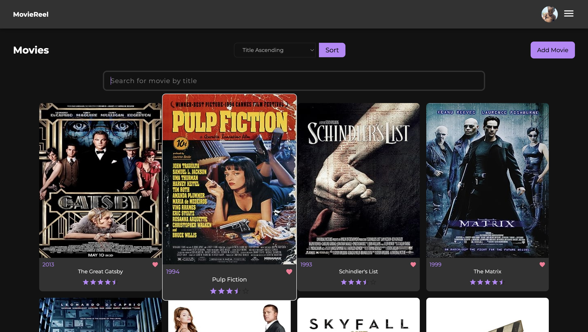

[](https://app.netlify.com/sites/movies-sringtho/deploys)

# MovieReel Frontend



MovieReel Frontend web application allows you to explore and manage movie-related information using a user-friendly interface. You can access movie details, create new records, and more. This application was created using react and hosted on netlify. You can access the live application here: [MovieReel Live App](https://movies-sringtho.netlify.app/)

## Features

- Create a movie database by adding movies.
- Mark movies as favorite and modify other details.
- Delete movies.
- Update user credentials and profile images
- Responsive design that works well on both desktop and mobile devices.

## Usage

1. Visit the live application at [MovieReel Live App](https://movies-sringtho.netlify.app/).
2. Login or create a new account
3. To add a new movie to your movie Database, click the "add movie" button and you will be redirected to the add movie page which contains a form that you can fill up and press the submit button.
4. To mark a movie as favorite or not favorite as, click the heart icon of any of the movies while on the homepage.
5. To delete a movie, click the "Delete" button which is visible on the movie detail page. This can be accessed after clicking on a movie title or thumbnail while on the homepage. You can also click the edit button which will redirect you to the edit movie form where you can edit a movie's details.
6. Your movie list will be saved, so you can return to it later.

## Development

If you want to run this application locally or modify it, you can follow these steps:

### Prerequisites

- Node.js: Make sure you have Node.js installed. You can download it from [nodejs.org](https://nodejs.org/).

1. Clone this repository:

   ```bash
   git clone https://github.com/ringtho/movielist-frontend.git
   cd movielist-frontend
2. Install the dependencies:
    ```bash
   npm install
3. Configure Environment Variables by creating a .env file and adding the following values
    ```
    REACT_APP_API_URL=http://127.0.0.1:5050/api/v1
    REACT_APP_OMDB_API_KEY=your_omdb_api_key
    ```
    - REACT_APP_API_URL: This variable should point to the base URL where the MovieReel Backend API is hosted. The default value is set to the local development URL. The instructions for setting up the API locally can be accessed here: [MovieReel Database API](https://github.com/ringtho/movielist-backend)
    - If you want to run the app on the live deployed API use 
    ```
    REACT_APP_API_URL=https://movie-sringtho-8352b0c3e296.herokuapp.com/api/v1
    REACT_APP_OMDB_API_KEY=your_omdb_api_key
    ```

    - REACT_APP_OMDB_API_KEY: To access movie details from the OMDB API, you'll need an API key from OMDB. Replace your_omdb_api_key with your actual OMDB API key.

    **Note**: Make sure to replace `your_omdb_api_key` in the `.env` configuration with your actual OMDB API key. Users can obtain their OMDB API key by registering on the [OMDB API website](http://www.omdbapi.com/apikey.aspx).

3. Start the development server:
    ```bash
    npm start
Open your web browser and navigate to http://localhost:3000 to view the application.

## Technologies Used
- React.js
- React Hooks
- React Router
- React Redux
- SCSS for styling
- Axios

## Deployment
The application is hosted on Netlify. Deployment is set up to be automatic whenever changes are pushed to the main branch.

## License
This project is licensed under the MIT License.

## Acknowledgments
- Special thanks to the React community for providing a powerful and flexible library for building user interfaces.
- Icons, and a few components from [Material UI](https://mui.com/).


Happy movie exploring with MovieReel!

